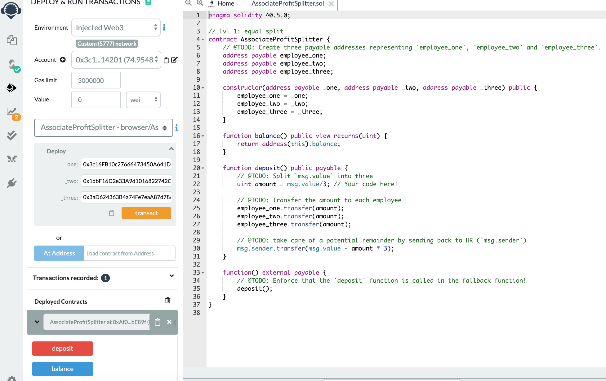
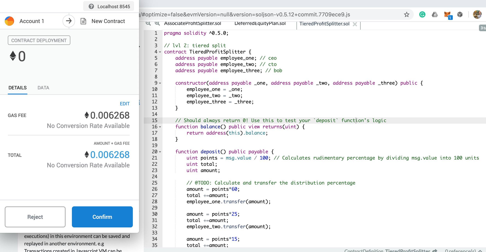
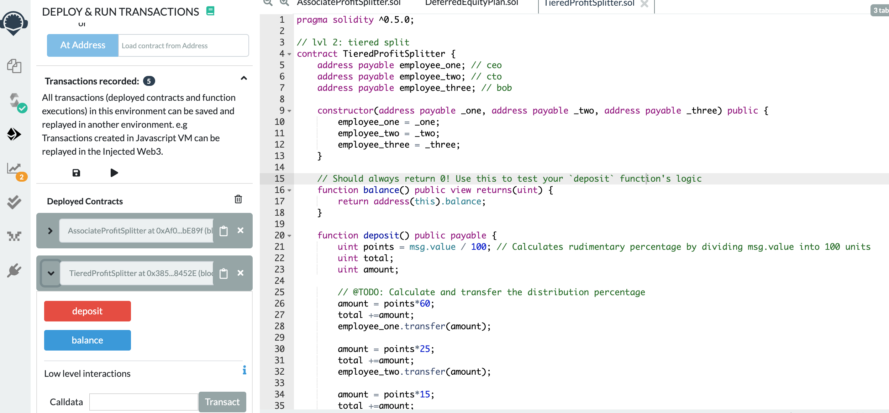
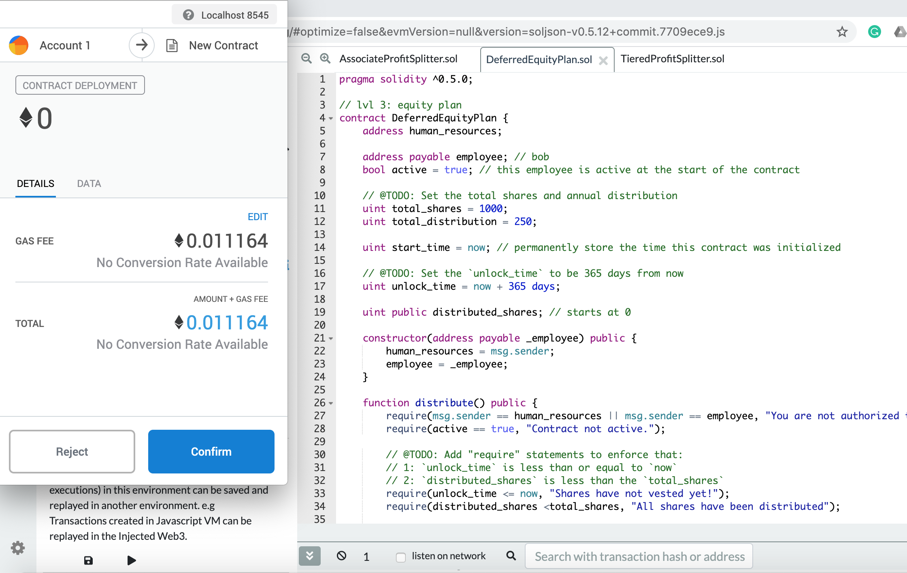
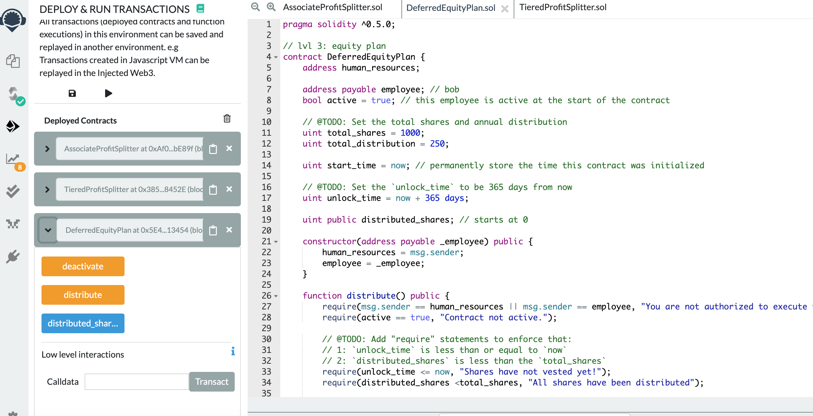

# Smart_Contract

There is three level of starter code in this homework. 

1. Level 1: AssociateProfitSplitter.sol
2. Level 2: TieredProfitSplitter.sol
3. Level 3: DeferredEquityPlan.sol

First, we are connected to MetaMask (Ethereum Wallet) and our Localhost 8545 at the same time. Then, the three contracts are compiled and deployed to Injected Web3 environment. 

The following are the screenshots of compilation and deployment. 

### Contract_1:

* Deployment of the contract.

### Contract_2:

* Successfully connected to MetaMask. 

* Deployment of the contract.

### Contract_3:

* Successfully connected to MetaMask and our localhost.

* Deployment of the contract. 

